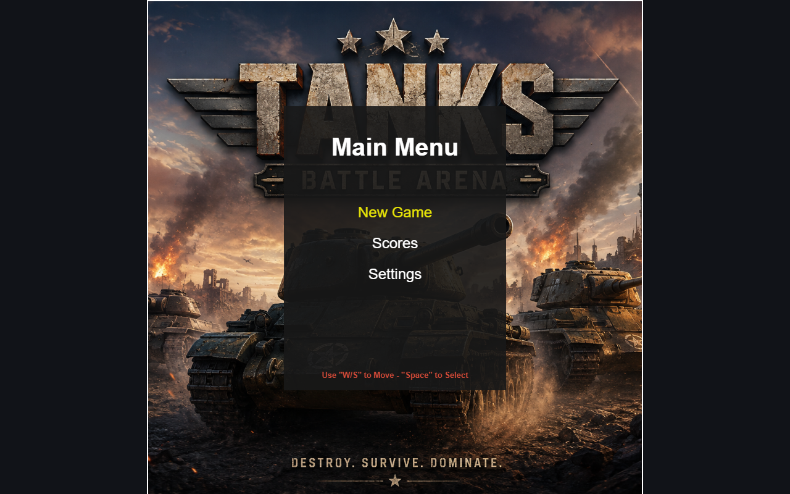
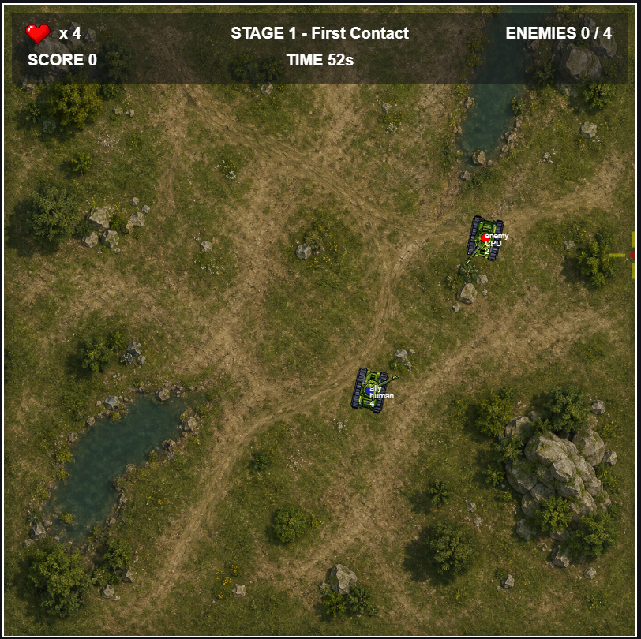
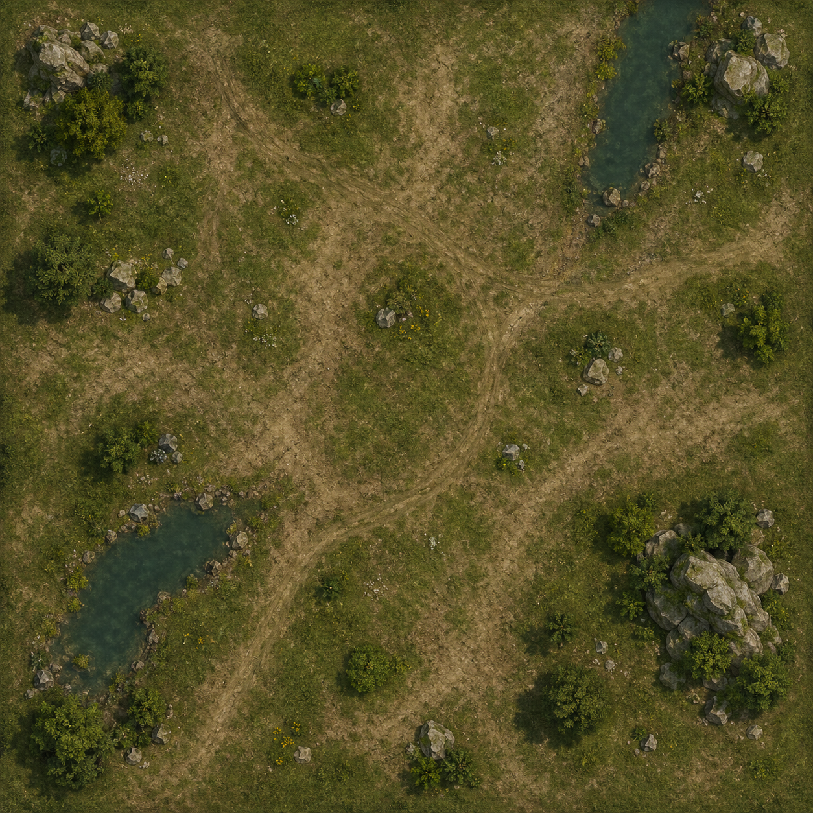
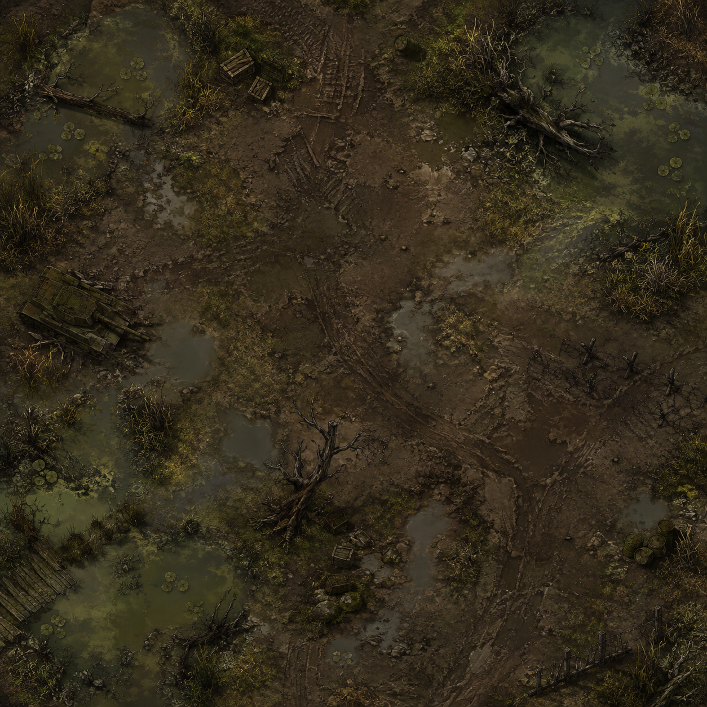

# Tanks 1.1

Tanks es un juego 2D desarrollado con JavaScript vanilla y Canvas. El jugador controla un tanque, supera oleadas de enemigos manejados por una IA sencilla y registra su puntuación al finalizar la partida.

El proyecto fue construido como un MVP de portafolio, priorizando funcionalidad, código comprensible y una arquitectura directa sin frameworks ni dependencias externas.

## Capturas del juego

### Menú principal



### Gameplay



### Escenarios

| Stage 1 | Stage 2 |
| --- | --- |
|  |  |

## Características

- Menú principal con nueva partida, continuación y ranking.
- Pantalla de preparación antes de comenzar o reanudar una partida.
- Doce etapas con duración y oleadas de dificultad progresiva.
- Recuperación de la vida del jugador al comenzar una nueva etapa.
- Fondos reutilizables con un color de respaldo si la imagen no está disponible.
- Enemigos generados mediante eventos temporizados.
- Enemigos compuestos por tanque y cañón, igual que el jugador.
- IA básica capaz de moverse, apuntar y disparar.
- Proyectiles diferenciados por equipo.
- Detección de impactos mediante colisiones AABB.
- Límites físicos dentro del área de juego.
- Puntuación basada en enemigos eliminados.
- Resumen de victoria o derrota al finalizar cada etapa.
- Registro de nombre de cuatro caracteres.
- Ranking ordenado y persistente mediante `localStorage`.
- Música diferenciada para menú y partida.
- Efectos de sonido para los disparos.
- Settings con controles independientes de música y efectos.

## Controles

### Menú

| Acción | Control |
| --- | --- |
| Mover selección | `W` / `S` o flechas arriba/abajo |
| Seleccionar | `Espacio` |
| Volver | `Escape` |

### Partida

| Acción | Control |
| --- | --- |
| Avanzar y retroceder | `W` / `S` |
| Girar | `A` / `D` |
| Apuntar | Movimiento del mouse |
| Disparar | Clic izquierdo |
| Comenzar o reanudar | `Espacio` |
| Volver al menú | `Escape` |

### Registro de puntuación

| Acción | Control |
| --- | --- |
| Cambiar posición | `A` / `D` |
| Cambiar carácter | `W` / `S` |
| Guardar | `Espacio` o `Enter` |
| Volver al menú | `Escape` |

### Settings

| Acción | Control |
| --- | --- |
| Mover selección | `W` / `S` o flechas arriba/abajo |
| Activar o desactivar | `Espacio` |
| Cambiar volumen | `A` / `D` o flechas izquierda/derecha |
| Volver | `Escape` o seleccionar Back |

## Objetivo

Elimina todos los enemigos generados antes de que termine el tiempo de la etapa.

La etapa termina con victoria cuando se generaron y eliminaron todos sus enemigos. Termina con derrota si el jugador pierde toda su vida o si se agota el tiempo sin completar el objetivo.

Después de superar una etapa:

- Si quedan más etapas, se carga la siguiente y se restaura la vida del jugador.
- Si era la última etapa, la partida termina con victoria.
- Si la etapa fue perdida, la partida termina en `game over`.

La campaña contiene doce etapas. Sus oleadas aumentan progresivamente en cantidad y cambian las direcciones desde las que aparecen los enemigos.

## Ejecutar el proyecto

Este proyecto utiliza módulos ES, por lo que debe abrirse mediante un servidor local.

Una opción sencilla es utilizar la extensión Live Server de Visual Studio Code:

1. Clona o descarga el repositorio.
2. Abre la carpeta del proyecto en Visual Studio Code.
3. Abre `index.html` con Live Server.
4. Accede a la dirección local mostrada por la extensión.

No requiere instalación de paquetes ni proceso de compilación.

## Flujo del juego

```text
Menú
  └─ Nueva partida
       └─ Ready
            └─ Etapa en ejecución
                 ├─ Etapa superada → Resumen → Siguiente etapa
                 └─ Etapa perdida  → Resumen → Game Over

Última etapa superada / Game Over
  └─ Registrar nombre
       └─ Ranking
            └─ Menú
```

## Arquitectura

El juego utiliza una estructura basada en clases con responsabilidades concretas:

- `App`: administra el Canvas, el input, el game loop y las pantallas principales.
- `Menu`: controla las opciones, Settings y la navegación del menú.
- `Game`: coordina jugador, enemigos, balas, colisiones, HUD y progresión.
- `Stage`: controla el tiempo, las oleadas, el resultado y el fondo de cada etapa. Si una imagen no carga, utiliza un color de respaldo.
- `Player`: representa tanto al usuario como a los jugadores controlados por IA.
- `Tank`: contiene el cuerpo, vida, velocidad y representación visual del vehículo.
- `Canon`: apunta y genera los datos de cada disparo.
- `Bullet`: representa y actualiza los proyectiles de ambos equipos.
- `Collision`: comprueba intersecciones AABB y límites del mundo.
- `HUD`: muestra vida, puntuación, enemigos y datos de la etapa.
- `Score`: administra el ranking y su persistencia.
- `EnterScore`: controla la introducción del nombre del jugador.

### Estados principales

```text
App:   menu | game | score
Game:  ready | running | stageSummary | finished
Stage: running | finished
Score: ranking | enterName
```

Los resultados se mantienen separados de los estados de ejecución:

```text
Game result:  completed | gameOver
Stage result: completed | failed
```

## Estructura del proyecto

```text
.
├── assets/
│   ├── backgrounds/
│   ├── canons/
│   ├── tanks/
│   └── turrets/
├── js/
│   ├── entities/
│   ├── stages/
│   ├── app.js
│   ├── collision.js
│   ├── enterScore.js
│   ├── game.js
│   ├── menu.js
│   └── score.js
├── index.html
├── main.js
└── styles.css
```

## Tecnologías

- HTML5
- CSS3
- JavaScript ES Modules
- Canvas 2D API
- Web Storage API (`localStorage`)

## Datos locales

Las preferencias y puntuaciones se guardan bajo una única clave:

```text
tanksStorage
```

El almacenamiento contiene los settings de música y efectos junto con el ranking local.

## Posibles mejoras

Estas ideas quedan fuera del alcance de la versión actual:

- Incorporar más vehículos y armas.
- Añadir obstáculos y colisiones entre entidades.
- Crear nuevos tipos de enemigos y comportamientos de IA.
- Agregar efectos visuales de impactos y explosiones.
- Mejorar el balance y la progresión de dificultad.
- Adaptar el Canvas a diferentes tamaños de pantalla.
- Añadir pruebas automatizadas para la lógica del juego.
